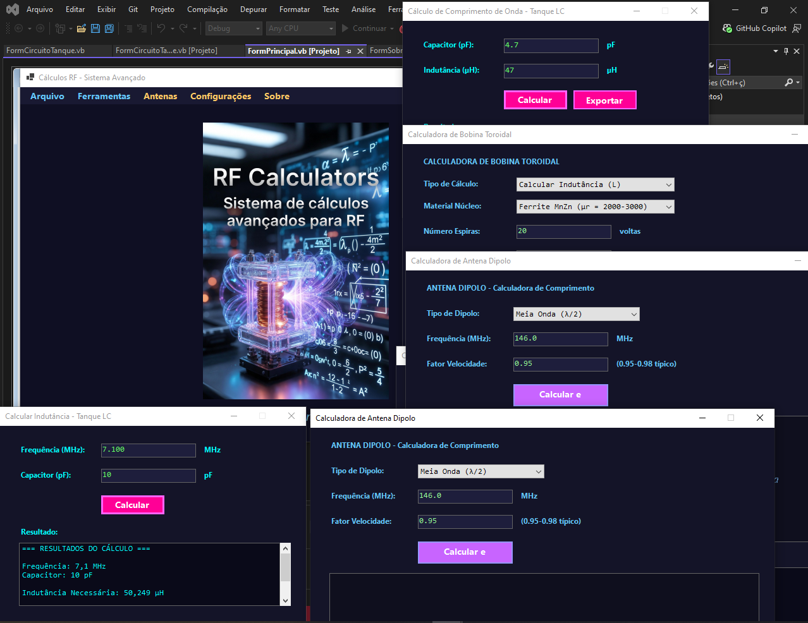

          
## Calculadora de RF para RadioAmdorismo
Software desenvolvido em VB.NET com o uso de IA para um resultado mais preciso.
Essa ferramenta possue calculos para comprimento de onda, indutância, achar o capacitor, achar o indutor, conversão Dbm -> Watts, espiras de bobina, calcula L por dimenções, Calculadora de baloons,Bobina toroidal,Tem um gerador de sinais de audio e calculos de antenas. Quase tudo que se precisa para trabalhar com radio transmissão.
 Se alguem encontar algum bug ou erro por gentileza me envie para correção.

 
 

## Authors

- [@mamedio1](https://www.github.com/mamedio1)

## 🚀 About Me
Eu sou o Robson, sou Programador Front End, atualmene estou aprendendo e criando projetos com HTML, CSS, JavaScript 
e iniciando aprendizado em React. Sou tecnólogo em Telecomunicações e Eletrônica e tenho pós em Docência do Ensino Superior.

## 🛠 Skills
Javascript, HTML, CSS, VB.NET...

## 🔗 Links

## License

[MIT](https://choosealicense.com/licenses/mit/)
